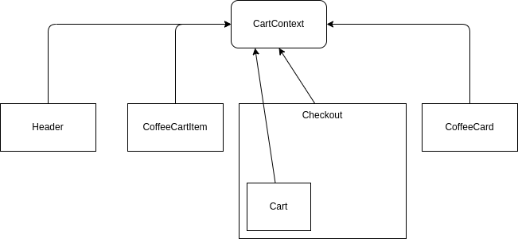
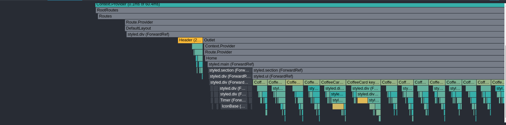
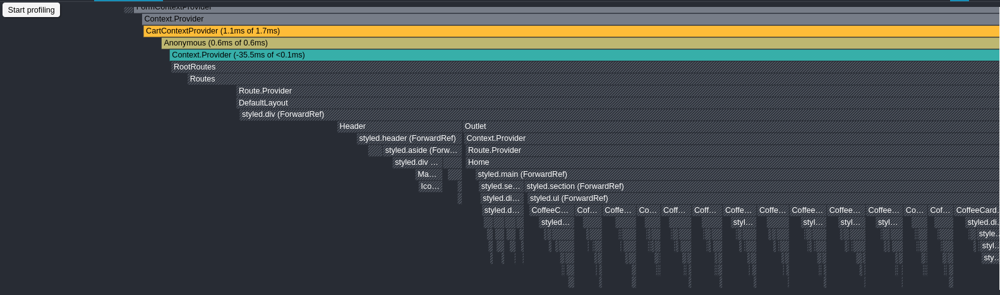

<h1 align="center">
    
    <br>
    Encontre o café perfeito para qualquer hora do dia
</h1>

<p align="center">

  


  

  <a href="https://github.com/andersonsilva019/ecommerce-coffee/commits/master">
    
  </a>

  <a href="https://github.com/andersonsilva019/ecommerce-coffee/issues">
    
  </a>

  <a href="https://github.com/andersonsilva019/ecommerce-coffee/pulls">
    
  </a>

</p>

<p align="center">
  <a href="#rocket-tecnologias">Tecnologias</a>
</p>


## :computer: Ecommerce Coffee

Esse projeto tem por finalidade aprimorar o desenvolvimento de um projeto de e-commerce com o React. Toda a estilização do projeto foi feita pelo styled-components. Para a parte do formulário de endereço de entrega, foi utilizado a biblioteca formik. Escolhi o formik para poder testar essa ferramenta.

Para realizar a simulação de chamadas a API, foi utilizado o json-server configurado para gerar uma latência de `750ms`.

```json
//package.json
"scripts": {
    ...
    "server": "json-server db.json -w -d 750 -p 3333"
  }
```
## :rocket: Tecnologias
- React
- Styled-components
- Formik
- React Router
- Json-server
- Yup

## Análise de performance na context API

A Context API é uma API que permite a passagem de informações entre componentes. Como nem tudo são flores, a Context API contém suas desvantagens. Se vários componentes utilizam o contexto, qualquer eventos que cause a renderização nesse contexto, isso fará com que todos os componentes que dependem desse contexto também sejam renderizados.

No diagrama abaixo podemos observar quais componentes fazem o uso das informações do contexto.



Na imagem abaixo podemos observar através do `profiler` da extensão react-devtools, quais componentes são renderizados ao clicar no botão de adicionar um café ao carrinho. 



Podemos observar todo esse comportamento ao selecionar a brach `main`. Agora vamos tornar nosso contexto mais performático. Note que na imagem abaixo, ao adicionar um café ao carrinho não ocorre as renderizações desnecessárias. Para analisar esse comportamento, selecione a branch `with-use-context-selector`.




Dessa forma, o componente que está sendo renderizado é o componente que está sendo usado como selector. Isso é um bom exemplo de como podemos melhorar o desempenho da aplicação. 

### Lib utilizada

[https://github.com/dai-shi/use-context-selector](https://github.com/dai-shi/use-context-selector)